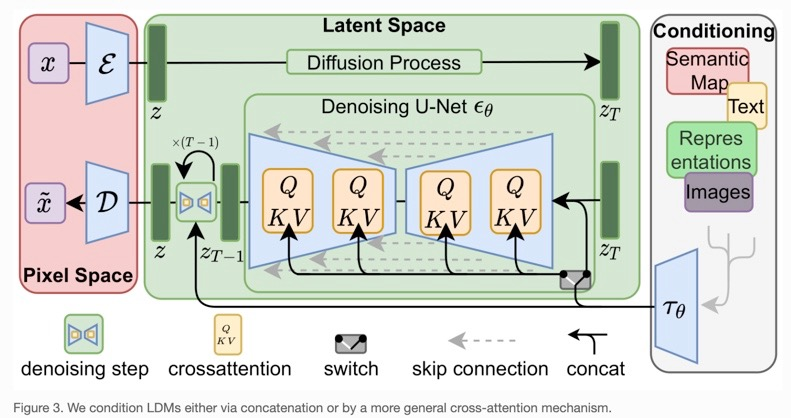

# Methodology (Part I)

## Moving to Latent Space

*Goal*: Move to a *"perceptually equivalent, but computationally more suitable space"*, i.e.: Preserve only relevant details to the image

### Perceptual Compression 

*Goal*: Preserve image likeness while punishing blurring

- Loss function : Perceptual loss + Patch-based adversarial objective

- NOTE: we want to avoid high-variance latent space, so KL regularization + VQ regularization (aka vector quantization in the decoder)

- Implemented through *AutoEncoder + GAN*

### Semantic Compression 

*Goal*: "[learn] the semantic and conceptual composition of the data"

- Image details lost, but same idea 

- Implemented through *Latent Diffusion Model*

## Latent Diffusion Models

### Diffusion models 

- learn distribution through gradual denoising of a normal distribution

- aka learning reverse process of [Markov chain](https://brilliant.org/wiki/markov-chains/#:~:text=A%20Markov%20chain%20is%20a,possible%20future%20states%20are%20fixed.)

- In image processing, use [variational lower bound](https://xyang35.github.io/2017/04/14/variational-lower-bound/) in a way similar to [denoising score-matching](https://arxiv.org/pdf/2011.13456.pdf)

### Generative Modeling of Latent Representations

- Cut away the fluff in image space to work with the core latent space (better for distributive modeling)

- Originally, with ex. [ViT-VQGAN](https://arxiv.org/pdf/2110.04627.pdf), people ran an attention/autoregressive model purely in the latent space

However, with generative modeling/diffusion models, can take advantage of "inductive biases". From [Wikipedia](https://en.wikipedia.org/wiki/Inductive_bias):
- The inductive bias (also known as learning bias) of a learning algorithm is the set of assumptions that the learner uses to predict outputs of given inputs that it has not encountered.[1]

- Loss is calculated by the expectation of the difference between the original layer output and the denoised decoder output at timestep t.

## Conditioning Mechanism

- Basically, the UNet has attention in its layers. Specifically, cross-attention, because the input of image latent space and CLIP text encoding space is different

### [Attention background](https://arxiv.org/pdf/1706.03762.pdf)

- 3 separate values : query Q, key K, value V

- Translate approximately to looking up a query Q through a set of keys K, and tranforming it into value space V 

In this case, the following are assigned to Q, K, and V:

- Q value is the input from the latent space of image

- K and V are derived from the CLIP text encoding

# Implementation (Part II)

## Overview 

## Core network details

- UNet -> 3 conv + deconv layers each
- CLIP ViT-L/14 Text encoder
- 4.5B Parameters for text-to-image synthesis

## Data used 

- 256x256 images ; not all of images in these datasets are 256x256, but were scaled up to fit the network
- CelebA dataset
- FFHQ (Flickr-Faces)
- LSUN Churches/Bedrooms 

- text-to-image: LAION 400m database

## Loss functions

- [Frechet Inception Distance (FID)](https://en.wikipedia.org/wiki/Fr%C3%A9chet_inception_distance)
